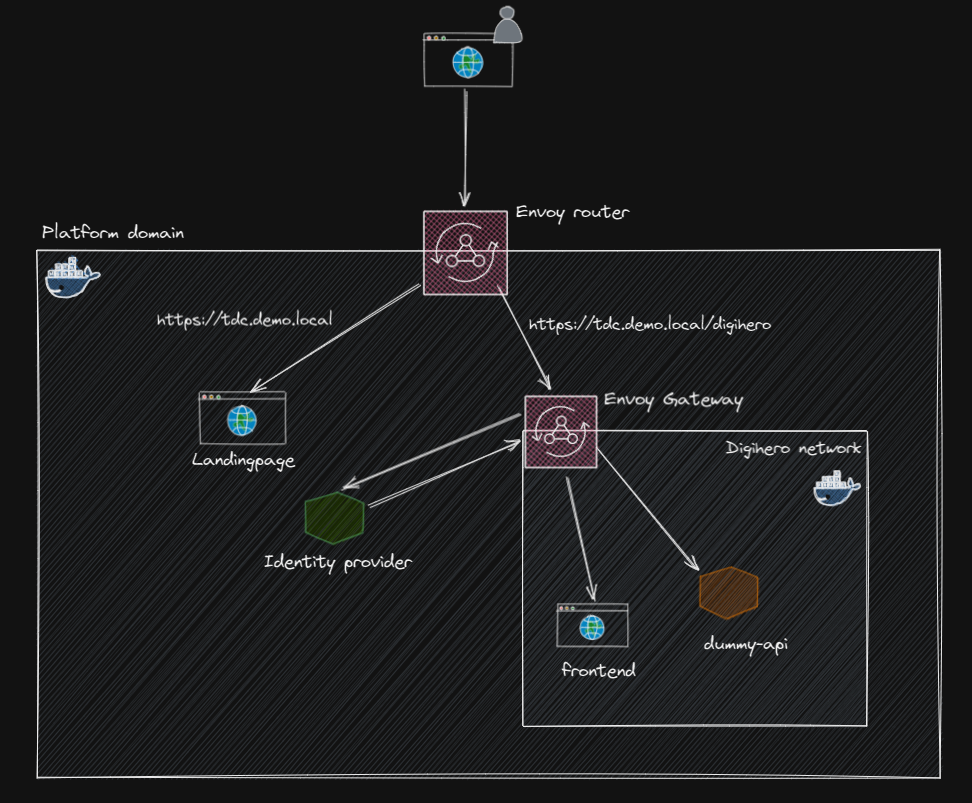

# **Envoy, a gateway for cloud native application/Envoy, um portão para aplicações cloud native?**

This is a repository containing a demo application using [Envoy proxy](https://www.envoyproxy.io/) to be presented in the [The Developer Conference](https://thedevconf.com/tdc/2021/transformation/).

## Get Started

You can get started running this application with a few sets of configurations and requisites.

### _Requisites_

You need to have the following softwares installed.

- Docker/docker-compose

### _Configuration_

For _Windows_ users, you can configure everything needed executing the following command as administrator from the root folder of the repository:

```
./setup.ps1
```

For _non-Windows_ users, you will need to manually configure the following items:

- Add the following host entries to your host file config for the IP `127.0.0.1`:
  - tdc.demo.local
  - dex.tdc.demo.local
- Import the trusted ssl certificates located at `.\platform\router\ssl\cert.crt` to your machine.
- Create a file at `.\apps\digihero\env\.env.secrets` containing the following variables.
  - OAUTH2_PROXY_CLIENT_ID=b3b88048-eee2-4658-bff1-5a50361655b3
  - OAUTH2_PROXY_CLIENT_SECRET=dDK-Dztp5DdswHp14IkT0zpSS_xxijLtR-wQIBv5

### _Run_

Then start running the container executing the following command:

```
docker-compose up -d
```

Once all the containers are running you can open the applications in the browser using the addresses: https://tdc.demo.local/digihero or https://tdc.demo.local

**_Note: You can check the container status performing `docker-compose ps`._**

## Architecture Design

The application is emulating a cloud platform solution based on containers that should be able to support multiples products/services under the same domain.

<br>



<br>

### **Platform components definition**

| Component             | Details                                                                                                                                       |
| --------------------- | --------------------------------------------------------------------------------------------------------------------------------------------- |
| **Envoy router**      | Emulates the behavior of the `Cloud Provider` routers handling the incoming requests from users forwarding it to the respective domains/apps. |
| **Identity provider** | Responsible for authenticating the user based on `OpenID Connect`.                                                                            |
| **Landingpage**       | Friendly page of the platform responsible to show the available app/services catalog to the users.                                            |

<br>

### **Digihero components definition**

Digihero is the demo application hosted under the platform domain for the path `/digihero`.

| Component         | Details                                                                                                                        |
| ----------------- | ------------------------------------------------------------------------------------------------------------------------------ |
| **Envoy gateway** | Entrypoint responsible to handle all the incoming requests to the application. It's the only component exposed to the routers. |
| **Frontend**      | Frontend to be displayed to the user under the path `/digihero`.                                                               |
| **Dummy-api**     | Example of micro service to receive Api calls from the frontend.                                                               |

<br>
